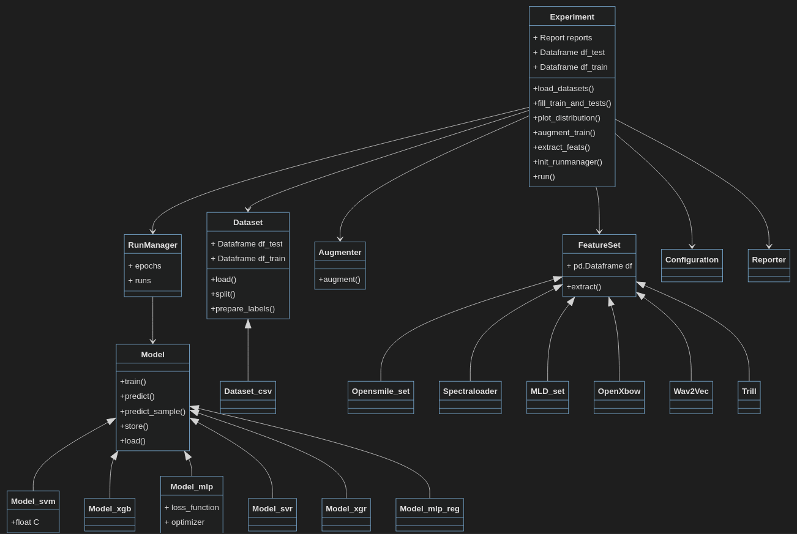

# Nkululeko

## Description
A project to detect speaker characteristics by machine learning experiments with a high level interface based on [audformat](https://github.com/audeering/audformat).
The idea is to have a very high level framework (based on e.g. sklearn and pytorch) that can be used by people not being experienced programmers as they mainly have to adapt the initialization parameter files.

* Below is a [Hello World example](#helloworld) that should set you up fastly.
* [Here's a blog post on how to set up nkululeko on your computer.](http://blog.syntheticspeech.de/2021/08/30/how-to-set-up-your-first-nkululeko-project/)
* [Here's a slide presentation about nkululeko](docs/nkululeko.pdf)
* [Here's a video presentation about nkululeko](https://www.youtube.com/watch?v=Ueuetnu7d7M)
* [Here's the 2022 LREC article on nkululeko](http://felix.syntheticspeech.de/publications/Nkululeko_LREC.pdf)

## Installation
Download the sources via git clone or zip export to your hard drive.
Include the classes via 
```
import sys
sys.path.append("./src")
```
in your main python file and use them.
An example is the [my_experiment.py](demos/my_experiment.py) file.

## Usage
There is a central "experiment" class that can be used by own experiments, two examples are given with
* [my_experiment.py](demos/my_experiment.py) ([configuration](demos/exp_emodb.ini)), using SVM classifier
* [configuration](demos/exp_emodb_mlp.ini), using MLP classifier

There's my [blog](http://blog.syntheticspeech.de/?s=nkululeko) with tutorials:
* [How to set up your first nkululeko project](http://blog.syntheticspeech.de/2021/08/30/how-to-set-up-your-first-nkululeko-project/)
* [Setting up a base nkululeko experiment](http://blog.syntheticspeech.de/2021/10/05/setting-up-a-base-nkululeko-experiment/)
* [How to import a database](http://blog.syntheticspeech.de/2022/01/27/nkululeko-how-to-import-a-database/) 
* [Comparing classifiers and features](http://blog.syntheticspeech.de/2021/10/05/nkululeko-comparing-classifiers-and-features/)
* [Use Praat features](http://blog.syntheticspeech.de/2022/06/27/how-to-use-selected-features-from-praat-with-nkululeko/)
* [Combine feature sets](http://blog.syntheticspeech.de/2022/06/30/how-to-combine-feature-sets-with-nkululeko/)
* [Classifying continuous variables](http://blog.syntheticspeech.de/2022/01/26/nkululeko-classifying-continuous-variables/) 
* [Try out / demo a trained model](http://blog.syntheticspeech.de/2022/01/24/nkululeko-try-out-demo-a-trained-model/) 
* [Perform cross database experiments](http://blog.syntheticspeech.de/2021/10/05/nkululeko-perform-cross-database-experiments/)
* [Meta parameter optimization](http://blog.syntheticspeech.de/2021/09/03/perform-optimization-with-nkululeko/)
* [How to set up wav2vec embedding](http://blog.syntheticspeech.de/2021/12/03/how-to-set-up-wav2vec-embedding-for-nkululeko/)
* [How to soft-label a database](http://blog.syntheticspeech.de/2022/01/24/how-to-soft-label-a-database-with-nkululeko/) 
* [Re-generate the progressing confusion matrix animation wit a different framerate](demos/plot_faster_anim.py)
* [How to limit/filter a dataset](http://blog.syntheticspeech.de/2022/02/22/how-to-limit-a-dataset-with-nkululeko/)
* [Specifying database disk location](http://blog.syntheticspeech.de/2022/02/21/specifying-database-disk-location-with-nkululeko/) 
* [Add dropout with MLP models](http://blog.syntheticspeech.de/2022/02/25/adding-dropout-to-mlp-models-with-nkululeko/)
* [Do cross-validation](http://blog.syntheticspeech.de/2022/03/23/how-to-do-cross-validation-with-nkululeko/)
* [Combine predictions per speaker](http://blog.syntheticspeech.de/2022/03/24/how-to-combine-predictions-per-speaker-with-nkululeko/)
* [Run multiple experiments in one go](http://blog.syntheticspeech.de/2022/03/28/how-to-run-multiple-experiments-in-one-go-with-nkululeko/)
* [Compare several MLP layer layouts with each other](http://blog.syntheticspeech.de/2022/04/11/how-to-compare-several-mlp-layer-layouts-with-each-other/)
* [Import features from outside the software](http://blog.syntheticspeech.de/2022/10/18/how-to-import-features-from-outside-the-nkululeko-software/)

The framework is targeted at the speech domain and supports experiments where different classifiers are combined with different feature extractors.

Here's a rough UML-like sketch of the framework.


Currently the following linear classifiers are implemented (integrated from sklearn):
* SVM, SVR, XGB, XGR
  and the following ANNs
* MLP, CNN (tbd)

Here's [an animation that shows the progress of classification done with nkululeko](https://youtu.be/6Y0M382GjvM)

### Initialization file
You could 
* use a generic main python file (like my_experiment.py), 
* adapt the path to your nkululeko src 
* and then adapt an .ini file (again fitting at least the paths to src and data)
  
Here's [an overview on the ini-file options](./ini_file.md)

### <a name="helloworld">Hello World example</a>
* Set up Python on your computer, version >= 3.6
* Open a terminal/commandline/console window
* Test python by typing ```python```, python should start with version >3 (NOT 2!)
* Create a folder on your computer for this example, let's call it *nkulu_work*
* Download nkululeko and unpack to this folder, or use "git clone" (prefered, if you know git)  
* Make sure the folder is called *nkululeko* and not somethin else, e.g. *nkululeko_main*
* Get a copy of the [Berlin emodb in audformat](https://tubcloud.tu-berlin.de/s/LzPWz83Fjneb6SP/download) and unpack the same folder (*nkulu_work*)
* Also, in the *nkulu_work* folder: 
  * Create a python environment
    * ```python3 -m venv venv```
  * Then, activate it:
    * under linux / mac
      * ```source venv/bin/activate```
    * under Windows
      * ```venv\Scripts\activate.bat```
    * if that worked, you should see a ```(venv)``` in front of your prompt
  * Install the required packages in your environment
    * ```pip install -r ./nkululeko/requirements.txt```
* Now you should have three folders in your *nkulu_work* folder:
  * *emodb*, *nkululeko* and *venv*
* Run the demo
  * ```python ./nkululeko/demos/my_experiment.py```
* Find the results in the newly created folder exp_emodb 
  * Inspect ```exp_emodb/images/run_0/emodb_xgb_os_0_000_cnf.png```
  * This is the main result of you experiment: a confusion matriix for the emodb emotional categories
* Inspect and play around with the [demo configuration file](demos/exp_emodb.ini) that defined your experiment, then re-run.
  
### Features
* Classifiers: XGB, XGR, SVM, SVR, MLP
* Feature extractors: opensmile, openXBOW BoAW, TRILL embeddings, Wav2vec2 embeddings, ...
* Feature scaling
* Label encoding
* Binning (continuous to categorical)
* Online demo interface for trained models 

### Outlook
* Classifiers: CNN
* Feature extractors: mid level descriptors, Mel-spectra

## Licence
Nkululeko can be used under the [MIT license](https://choosealicense.com/licenses/mit/)